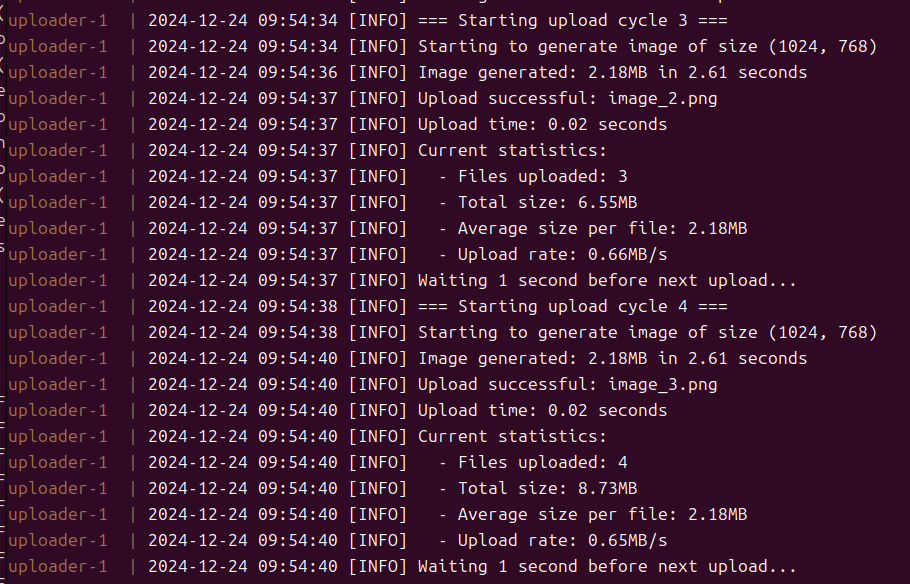
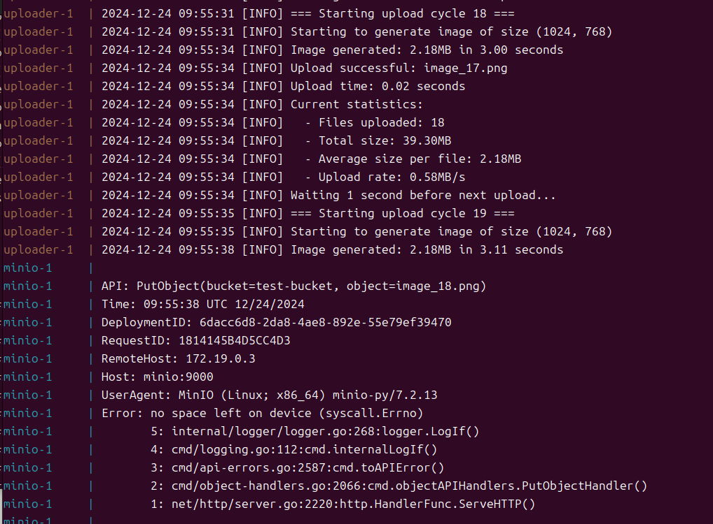

[中文](./README.md) | [Русский](./README.ru.md) 

# MinIO 存储任务
本项目实现了基于 MinIO 的对象存储服务，包括容量限制测试和自动数据上传功能。主要特点是在 Docker 容器中运行 MinIO 服务，并使用单独的容器进行随机图片的自动生成和上传，用于测试存储限制功能。

## 项目结构
```
minio/
├── uploader/
│   ├── Dockerfile          # 上传器容器配置文件
│   ├── requirements.txt    # Python 依赖列表
│   └── upload.py          # 数据上传脚本
├── config/
│   └── .env               # MinIO 环境配置文件
└── docker-compose.yml     # 容器编排文件
```

## 配置说明
### MinIO 服务配置 (.env)
```
MINIO_ROOT_USER=minioadmin
MINIO_ROOT_PASSWORD=minioadmin
MINIO_ADDRESS=:9000
MINIO_CONSOLE_ADDRESS=:9001
MINIO_BROWSER_DISK_TOTAL_BYTES=31457280
MINIO_BROWSER_DISK_USED_BYTES=0
```

### 存储限制配置
- MinIO 服务器配置：30MB (MINIO_BROWSER_DISK_TOTAL_BYTES)
- 容器限制：40MB (/data:size=40M,exec)

## 运行指南
1. 克隆项目
   ```bash
   git clone <repository-url>
   cd minio
   ```

2. 启动服务
   ```bash
   sudo docker-compose up -d
   ```

3. 访问服务
   - MinIO API：http://localhost:9000
   - MinIO 控制台：http://localhost:9001
     - 用户名：minioadmin
     - 密码：minioadmin

4. 查看上传日志
   ```bash
   sudo docker compose logs -f uploader
   ```

## 测试结果
### 存储使用情况
- 已使用容量：39.3 MiB
- 对象数量：18
- 存储桶：test-bucket
- 访问权限：读/写

### 容量限制测试结果
当达到存储限制时，系统表现如下：

1. 服务器端
   - 显示错误消息：`Error: no space left on device (syscall.Errno)`
   - 拒绝新的上传请求
   

2. 客户端在存储满前后的行为
   - 正常工作状态：
     
     - 文件上传成功
     - 系统运行稳定
   - 达到限制时状态：
     
     - 停止新文件上传
     - 清晰指示存储限制达到
     - 自动停止上传进程

3. 客户端行为
   - 上传请求被拒绝
   - 接收到明确的空间不足错误消息
   - 自动停止上传过程并记录已上传数据量
   - 磁盘使用率显示 98.60% (39.4MiB/40.0MiB)
   
   
   

### 监控方法
1. 通过 MinIO 控制台监控
   - 实时跟踪存储使用情况
   - 监控对象数量
   - 查看错误日志

2. 容器日志监控
   - 使用 `docker compose logs` 查看上传状态
   - 观察错误消息和处理过程
   - 跟踪上传进度
