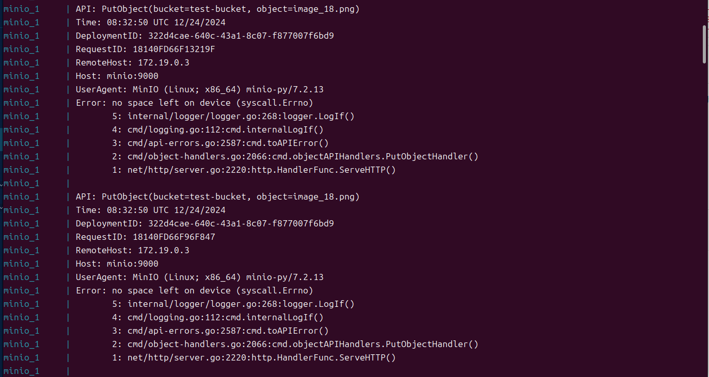
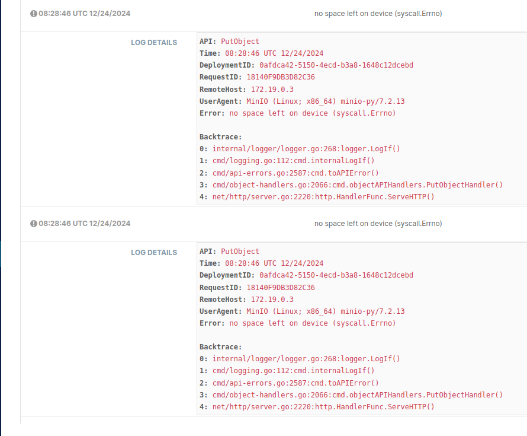
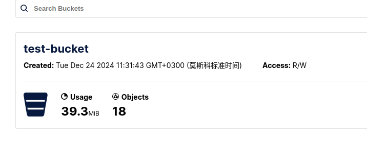
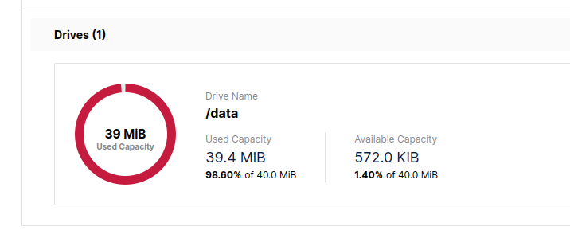

# Задание по хранилищу MinIO

Этот проект реализует сервис объектного хранилища на базе MinIO, включая тестирование ограничений емкости и функцию автоматической загрузки данных. Основной особенностью является запуск службы MinIO в контейнере Docker и использование отдельного контейнера для автоматической генерации и загрузки случайных изображений для тестирования функции ограничения хранилища.

## Структура проекта

```
minio/
├── uploader/
│   ├── Dockerfile          # Файл конфигурации контейнера загрузчика
│   ├── requirements.txt    # Список зависимостей Python
│   └── upload.py          # Скрипт загрузки данных
├── config/
│   └── .env               # Файл конфигурации среды MinIO
└── docker-compose.yml     # Файл оркестрации контейнеров
```

## Конфигурация

### Конфигурация службы MinIO (.env)
```
MINIO_ROOT_USER=minioadmin
MINIO_ROOT_PASSWORD=minioadmin
MINIO_ADDRESS=:9000
MINIO_CONSOLE_ADDRESS=:9001
MINIO_BROWSER_DISK_TOTAL_BYTES=31457280
MINIO_BROWSER_DISK_USED_BYTES=0
```

### Конфигурация ограничений хранилища
- Конфигурация сервера MinIO: 30МБ (MINIO_BROWSER_DISK_TOTAL_BYTES)
- Ограничение контейнера: 40МБ (/data:size=40M,exec)

## Инструкция по запуску

1. Клонирование проекта
   ```bash
   git clone <repository-url>
   cd minio
   ```

2. Запуск служб
   ```bash
   sudo docker-compose up -d
   ```

3. Доступ к сервисам
   - MinIO API: http://localhost:9000
   - MinIO Console: http://localhost:9001
     - Имя пользователя: minioadmin
     - Пароль: minioadmin

4. Просмотр логов загрузки
   ```bash
   sudo docker compose logs -f uploader
   ```

## Результаты тестирования

### Использование хранилища
- Использованная емкость: 39.3 MiB
- Количество объектов: 18
- Бакет: test-bucket
- Права доступа: R/W

### Результаты тестирования ограничений емкости
При достижении ограничения хранилища система ведет себя следующим образом:

1. Со стороны сервера
   - Отображается сообщение об ошибке: `Error: no space left on device (syscall.Errno)`
   - Отклоняются новые запросы на загрузку
   

2. Поведение клиента до и после заполнения хранилища
   - Нормальное состояние работы:
     
     - Успешное выполнение загрузки файлов
     - Стабильное функционирование системы

   - Состояние при достижении лимита:
     
     - Прекращение загрузки новых файлов
     - Четкая индикация достижения лимита хранилища
     - Автоматическая остановка процесса загрузки

3. Поведение клиента
   - Запросы на загрузку отклоняются
   - Получение четкого сообщения об ошибке нехватки места
   - Автоматическая остановка процесса загрузки и запись объема загруженных данных
   - Использование диска показывает 98.60% (39.4MiB/40.0MiB)
    
    
   


### Методы мониторинга
1. Мониторинг через консоль MinIO
   - Отслеживание использования хранилища в реальном времени
   - Мониторинг количества объектов
   - Просмотр журнала ошибок

2. Мониторинг логов контейнера
   - Использование `docker compose logs` для просмотра статуса загрузки
   - Наблюдение за сообщениями об ошибках и процессом обработки
   - Отслеживание прогресса загрузки
